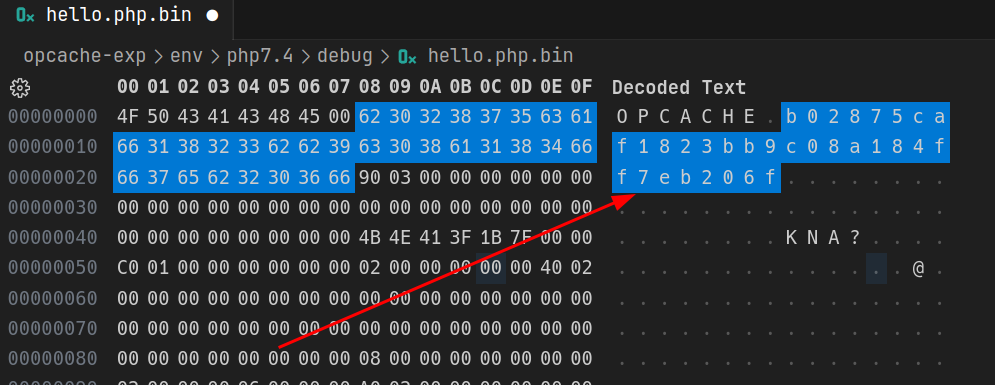

# Opcache-exp

## Introduction

OPcache 是一个 PHP 的字节码缓存和优化器，它可以在运行时缓存和优化 PHP 代码，从而提高 PHP 应用程序的性能。

OPcache 最初是由 Dmitry Stogov 在 PHP 5.5 中引入的，它是 Zend 引擎的一部分，它是 PHP 的核心组件之一。

当 PHP 应用程序启用 Opcache 时，对其相应速度的提升是十分明显的，因为不再需要每次请求都去解析一边 php 文件，而是可以直接读取内存或文件中编译好的字节码来对请求进行处理。

Opcache 默认使用的是共享内存中缓存的文件字节码，但是在 `php.ini` 中存在一个配置 `Opcache.file_cache` 可以用来指定文件缓存，也就是说将文件的字节码缓存到指定目录中：


这里我指定缓存目录为 `/tmp`。

## Debug Environment
这里参考 P 神的[项目](https://github.com/phith0n/phpsrc-debug-docker)，将其中进行一些修改即可，比如加上 `--enable-opcache` 的编译选项，然后对于一些不需要的模块和扩展，也可以选择不进行 enable。具体见 [Dockerfile](./env/php7.4/debug/Dockerfile)

直接在 `debug` 目录下运行 `setup.sh` 即可生成镜像，然后使用 `docker logs debug` 可以看到容器启动时输出的 ssh 私钥信息，将其保存后使用以下命令进行连接：
```bash
chmod 600 /path/to/privatekey
ssh -i /path/to/privatekey -p2222 root@ip
```
这里建议直接使用 vscode 的 `Remote-SSH` 插件连接，连接后进入源码目录 `/usr/src/php`，创建下面的调试启动文件即可进行调试。

> 需要注意的是，因为在 Docker 中是编译得到的 apache2，所以需要在 `/usr/local/apache2/conf/httpd.conf` 中加上对 php 解析的配置。

`.vscode/launch.json`:
```json
// 对于 php -S 直接启动服务的调试
{
    "version": "0.2.0",
    "configurations": [
        {
            "name": "debug",
            "type": "cppdbg",
            "request": "launch",
            "program": "/usr/local/bin/php",
            "args": ["-S","0.0.0.0:80","-t","/var/www/html"],
            "stopAtEntry": false,
            "cwd": "${fileDirname}",
            "environment": [],
            "externalConsole": false,
            "MIMode": "gdb",
            "setupCommands": [
                {
                    "description": "为 gdb 启用整齐打印",
                    "text": "-enable-pretty-printing",
                    "ignoreFailures": true
                }
            ]
        }

    ]
}

// 对于基于apache2启动的php服务调试
{
    "version": "0.2.0",
    "configurations": [
        {
            "name": "debug",
            "type": "cppdbg",
            "request": "launch",
            "program": "/usr/local/apache2/bin/httpd",
            "args": ["-X"],
            "stopAtEntry": false,
            "cwd": "${fileDirname}",
            "environment": [],
            "externalConsole": false,
            "MIMode": "gdb",
            "setupCommands": [
                {
                    "description": "为 gdb 启用整齐打印",
                    "text": "-enable-pretty-printing",
                    "ignoreFailures": true
                }
            ]
        }

    ]
}
```

## Opcache Under php7.4.33

使用以下 `Dockerfile` 搭建环境：

```dockerfile
FROM php:7.4-apache

RUN apt-get update && apt-get install -y vim
RUN docker-php-ext-install opcache && docker-php-ext-enable opcache
COPY ./opcache.ini $PHP_INI_DIR/conf.d/
COPY ./index.php /var/www/html/
RUN service apache2 restart
```
其中 `opcache.ini` 关键配置如下：
```ini
; Determines if Zend OPCache is enabled
; 是否开启 opcache 服务
opcache.enable=1

; Determines if Zend OPCache is enabled for the CLI version of PHP
; 针对 cli 版本的 php 运行是否启用 opcache
opcache.enable_cli=1

; When disabled, you must reset the OPcache manually or restart the
; webserver for changes to the filesystem to take effect.
; 缓存有效期时间戳，0代表永远不更新，1代表开启更新
opcache.validate_timestamps=0

; Enables and sets the second level cache directory.
; It should improve performance when SHM memory is full, at server restart or
; SHM reset. The default "" disables file based caching.
; 文件缓存的目录
opcache.file_cache=/tmp

; Enables or disables opcode caching in shared memory.
; 启用或禁用在共享内存中的缓存
opcache.file_cache_only=1
```

在容器中看一眼 `/tmp` 目录：


可以看到存在一个属主为 `www-data` 用户的文件夹，这就是 Opcache 文件缓存的文件夹，目录名为 `system-id` ，是根据不同主机的配置进行计算的，当访问 `phpinfo.php` 这个文件后会在 `/tmp/[system-id]/var/www/html` 文件夹下生成一个 `phpinfo.php.bin` 的文件，查看其十六进制内容：

```bash
root@b1284020fd73:/tmp/b02875caf1823bb9c08a184ff7eb206f/var/www/html# xxd phpinfo.php.bin 
00000000: 4f50 4341 4348 4500 6230 3238 3735 6361  OPCACHE.b02875ca
00000010: 6631 3832 3362 6239 6330 3861 3138 3466  f1823bb9c08a184f
00000020: 6637 6562 3230 3666 d802 0000 0000 0000  f7eb206f........
00000030: 0000 0000 0000 0000 0000 0000 0000 0000  ................
00000040: 0000 0000 0000 0000 8741 fdf1 4d7f 0000  .........A..M...
00000050: c001 0000 0000 0000 0200 0000 0000 4002  ..............@.
00000060: 0000 0000 0000 0000 0000 0000 0000 0000  ................
00000070: 0000 0000 0000 0000 0000 0000 0000 0000  ................
00000080: 0000 0000 0000 0000 0800 0000 0000 0000  ................
00000090: 0000 0000 0300 0000 4002 0000 0000 0000  ........@.......
000000a0: 0000 0000 0000 0000 6030 87a0 4d7f 0000  ........`0..M...
000000b0: 0000 0000 0000 0000 0000 0000 0000 0000  ................
000000c0: 0000 0000 0000 0000 0000 0000 0000 0000  ................
000000d0: 0000 0000 0000 0000 0000 0000 0000 0000  ................
000000e0: a002 0000 0000 0000 0100 0000 0300 0000  ................
000000f0: 0000 0000 0000 0000 0200 0000 0000 0000  ................
00000100: 0002 0000 0000 0000 0000 0000 0000 0000  ................
00000110: 0000 0000 0000 0000 0000 0000 0000 0000  ................
00000120: 0000 0000 0000 0000 0000 0000 0000 0000  ................
00000130: 0000 0000 0000 0000 0100 0000 1700 0000  ................
00000140: 1800 0000 feff ffff 0000 0000 0000 0000  ................
00000150: 0000 0000 0000 0000 0800 0000 0000 0000  ................
00000160: 0000 0000 0000 0000 0000 0000 0000 0000  ................
00000170: 0100 0000 1700 0000 1800 0000 feff ffff  ................
00000180: 0000 0000 0000 0000 0000 0000 0000 0000  ................
00000190: 0800 0000 0000 0000 0000 0000 0000 0000  ................
000001a0: 0000 0000 0000 0000 ffff ffff 0000 0000  ................
000001b0: 0000 0000 0000 0000 0000 0000 0000 0000  ................
000001c0: 0000 0000 0000 0000 0100 0000 0000 0000  ................
000001d0: 0000 0000 0000 0000 d802 0000 0000 0000  ................
000001e0: 0002 0000 0000 0000 0000 0000 0000 0000  ................
000001f0: 0000 0000 0000 0000 0000 0000 0000 0000  ................
00000200: 0000 0000 533e 5526 0000 0000 0000 0000  ....S>U&........
00000210: 0200 0000 4600 0000 cef1 add1 ff01 9bc3  ....F...........
00000220: 1900 0000 0000 0000 2f76 6172 2f77 7777  ......../var/www
00000230: 2f68 746d 6c2f 7068 7069 6e66 6f2e 7068  /html/phpinfo.ph
00000240: 7000 0000 0000 0000 0000 0000 0000 0000  p...............
00000250: 2002 0000 0000 0000 0600 0000 0000 0000   ...............
00000260: 0100 0000 0000 0000 0400 0000 0000 0000  ................
00000270: 0100 0000 4600 0000 f9e0 f8ab b5d0 0080  ....F...........
00000280: 0700 0000 0000 0000 7068 7069 6e66 6f00  ........phpinfo.
00000290: 4005 0000 0000 0000 5000 0000 0000 0000  @.......P.......
000002a0: 0000 0000 0000 0000 0200 0000 3d00 0100  ............=...
000002b0: df07 0000 0000 0000 0000 0000 0000 0000  ................
000002c0: 0000 0000 0000 0000 0200 0000 8100 0000  ................
000002d0: 4105 0000 0000 0000 0100 0000 0000 0000  A...............
000002e0: 0000 0000 ffff ffff 0300 0000 3e01 0000  ............>...
000002f0: 0100 0000 4600 0000 cef1 add1 ff01 9bc3  ....F...........
00000300: 1900 0000 0000 0000 2f76 6172 2f77 7777  ......../var/www
00000310: 2f68 746d 6c2f 7068 7069 6e66 6f2e 7068  /html/phpinfo.ph
00000320: 7000 0000 0000 0000                      p.......
```
对于这个十六进制的文件，已经有人写了一个 010 解析的 bt 脚本，但由于 php 版本的问题可能只能解析较低版本的文件。
需要注意的是这里文件首部也会有 `system-id` 的出现。

那么实际上对于 opcache 开启 file_cache 的利用早在七八年前就已经有人提出来了，其需要满足一些条件：
* 能够获取系统信息，最好是 `phpinfo`；
* 能够上传文件到指定目录造成文件覆盖；
* 某些对于文件有效性的检查没有开启。

当然这里对于一些检查也是存在 bypass 的方法的，比如对于时间戳检查只需要想办法获取文件对应的时间戳然后修改 bin 文件中对应部分即可。

这里分享一下较高版本是如何生成 `system-id`。

那么最关键的一点实际上还是 `system-id` 的计算，只有计算出靶机对应的 `system-id` 才能覆盖相应 bin 文件。

需要知道怎么计算 `system-id` 我们就需要去阅读 php 的[源码](https://github.com/php/php-src/blob/PHP-7.4.33/ext/opcache/ZendAccelerator.c#L2661)

```c
static void accel_gen_system_id(void)
{
	PHP_MD5_CTX context;
	unsigned char digest[16];
	zend_module_entry *module;
	zend_extension *extension;
	zend_llist_position pos;

	PHP_MD5Init(&context);
	PHP_MD5Update(&context, PHP_VERSION, sizeof(PHP_VERSION)-1);
	PHP_MD5Update(&context, ZEND_EXTENSION_BUILD_ID, sizeof(ZEND_EXTENSION_BUILD_ID)-1);
	PHP_MD5Update(&context, ZEND_BIN_ID, sizeof(ZEND_BIN_ID)-1);
	if (strstr(PHP_VERSION, "-dev") != 0) {
		/* Development versions may be changed from build to build */
		PHP_MD5Update(&context, __DATE__, sizeof(__DATE__)-1);
		PHP_MD5Update(&context, __TIME__, sizeof(__TIME__)-1);
	}
	/* Modules may have changed after restart which can cause dangling pointers from
     * custom opcode handlers in the second-level cache files
     */
	ZEND_HASH_FOREACH_PTR(&module_registry, module) {
		PHP_MD5Update(&context, module->name, strlen(module->name));
		if (module->version != NULL) {
			PHP_MD5Update(&context, module->version, strlen(module->version));
		}
	} ZEND_HASH_FOREACH_END();
	extension = (zend_extension *) zend_llist_get_first_ex(&zend_extensions, &pos);
	while (extension) {
		PHP_MD5Update(&context, extension->name, strlen(extension->name));
		if (extension->version != NULL) {
			PHP_MD5Update(&context, extension->version, strlen(extension->version));
		}
		extension = (zend_extension *) zend_llist_get_next_ex(&zend_extensions, &pos);
	}
	PHP_MD5Final(digest, &context);
	php_hash_bin2hex(accel_system_id, digest, sizeof digest);
}
```
以上这种计算 `system-id` 的方式是在 `php-7.4.11` 之后出现的，在此之前都十分简单，只需要将 `PHP_VERSION` 和 `ZEND_EXTENSION_BUILD_ID` 以及 `ZEND_BIN_ID` 拼接后进行 md5 计算即可。

由于静态分析比较复杂，我们这里直接对 PHP 进行底层源码级别的调试，详细的部署过程在前面已经说明了，这里直接看调试过程。

这里直接监视 module 和 extension 的计算：


最后可以得到生成的 `system-id` 为：


对比我们计算得到的，可以发现完全一样：


所以在 `php7.4.11` 之后，还给 `system-id` 加上了一些模块和扩展的信息。

但是经过尝试发现，通过 `php -S` 启动的服务和基于 `apache2` 的服务所计算 `module` 和 `extension` 的顺序有所差别，所加载的模块等也有所差别。

对于更常见的 `apache2` 启动的 php 服务，其常见模块和扩展的加载顺序如下：
```basic
7.4.33
API320190902,NTS
BIN_48888
Core3.4.0
date7.4.33
libxml7.4.33
openssl7.4.33
pcre7.4.33
sqlite37.4.33
zlib7.4.33
ctype7.4.33
curl7.4.33
dom20031129
fileinfo7.4.33
filter7.4.33
ftp7.4.33
hash7.4.33
iconv7.4.33
json7.4.33
mbstring7.4.33
SPL7.4.33
PDO7.4.33
pdo_sqlite7.4.33
session7.4.33
posix7.4.33
Reflection7.4.33
standard7.4.33
SimpleXML7.4.33
Phar7.4.33
tokenizer7.4.33
xml7.4.33
xmlreader7.4.33
xmlwriter7.4.33
mysqlndmysqlnd 7.4.33
apache2handler7.4.33
sodium7.4.33
Zend OPcache7.4.33
```
通过这个顺序可以计算得到我们上面使用 `php:7.4-apache` 这个镜像搭建的环境的 `system-id` 为：


我们可以在调试容器中写一个 `hello.php` 的木马，然后访问一下生成一个 `hello.php.bin`，将其下载到本地后看看是否能成功覆盖测试容器并且 getshell。



然后再次访问即可 getshell：


## Opcache Under php8.2.8
类似于之前的环境搭建方式，这里我们主要看看在 `php8` 中 `system-id` 的计算方式发生了什么变化。

首先还是需要找到[源码](https://github.com/php/php-src/blob/php-8.2.8/Zend/zend_system_id.c)，在 `php8` 以后，直接是在 Zend 引擎加载时计算 `system-id`，因为 Zend 引擎在 `php8` 中与 Opcache 进行了集成，性能也有所提升。

虽然但是，`php8` 的 `system-id` 的计算方法还是没有 `php7.4.11` 之后那么阴间，源码如下：
```c
#define ZEND_BIN_ID "BIN_" ZEND_TOSTR(SIZEOF_INT) ZEND_TOSTR(SIZEOF_LONG) ZEND_TOSTR(SIZEOF_SIZE_T) ZEND_TOSTR(SIZEOF_ZEND_LONG) ZEND_TOSTR(ZEND_MM_ALIGNMENT)

void zend_startup_system_id(void)
{
	PHP_MD5Init(&context);
	PHP_MD5Update(&context, PHP_VERSION, sizeof(PHP_VERSION)-1);
	PHP_MD5Update(&context, ZEND_EXTENSION_BUILD_ID, sizeof(ZEND_EXTENSION_BUILD_ID)-1);
	PHP_MD5Update(&context, ZEND_BIN_ID, sizeof(ZEND_BIN_ID)-1);
	if (strstr(PHP_VERSION, "-dev") != 0) {
		/* Development versions may be changed from build to build */
		PHP_MD5Update(&context, __DATE__, sizeof(__DATE__)-1);
		PHP_MD5Update(&context, __TIME__, sizeof(__TIME__)-1);
	}
	zend_system_id[0] = '\0';
}

#define ZEND_HOOK_AST_PROCESS      (1 << 0)
#define ZEND_HOOK_COMPILE_FILE     (1 << 1)
#define ZEND_HOOK_EXECUTE_EX       (1 << 2)
#define ZEND_HOOK_EXECUTE_INTERNAL (1 << 3)

void zend_finalize_system_id(void)
{
	unsigned char digest[16];
	zend_uchar hooks = 0;

	if (zend_ast_process) {
		hooks |= ZEND_HOOK_AST_PROCESS;
	}
	if (zend_compile_file != compile_file) {
		hooks |= ZEND_HOOK_COMPILE_FILE;
	}
	if (zend_execute_ex != execute_ex) {
		hooks |= ZEND_HOOK_EXECUTE_EX;
	}
	if (zend_execute_internal) {
		hooks |= ZEND_HOOK_EXECUTE_INTERNAL;
	}
	PHP_MD5Update(&context, &hooks, sizeof hooks);

	for (int16_t i = 0; i < 256; i++) {
		if (zend_get_user_opcode_handler((zend_uchar) i) != NULL) {
			PHP_MD5Update(&context, &i, sizeof i);
		}
	}

	PHP_MD5Final(digest, &context);
	php_hash_bin2hex(zend_system_id, digest, sizeof digest);
	finalized = 1;
}
```
这里实际上是在 `system-id` 中加入了一些用户自定义 `php` 内核行为的信息，上面 `zend_finalize_system_id()` 函数中处理的变量都是 php 为用户提供的一些 hooks，具体的介绍可以参考[这篇文章](https://www.phpinternalsbook.com/php7/extensions_design/hooks.html)。

实际上这段代码是用于检查不同类型的钩子函数。钩子函数可以在一些特定的事件发生时自动被调用，以执行预定的操作。

在这段代码中，首先检查是否已经注册了 AST 钩子函数（通过判断 zend_ast_process 是否存在），如果已经注册，则将 ZEND_HOOK_AST_PROCESS 标志位设置为 1，表示已经注册了 AST 钩子函数。

然后，检查是否已经注册了编译文件的钩子函数（通过判断 zend_compile_file 是否等于 compile_file 函数），如果已经注册，则将 ZEND_HOOK_COMPILE_FILE 标志位设置为 1，表示已经注册了编译文件的钩子函数。

接着，检查是否已经注册了执行函数的钩子函数（通过判断 zend_execute_ex 是否等于 execute_ex 函数），如果已经注册，则将 ZEND_HOOK_EXECUTE_EX 标志位设置为 1，表示已经注册了执行函数的钩子函数。

最后，检查是否已经注册了内部执行函数的钩子函数（通过判断 zend_execute_internal 是否存在），如果已经注册，则将 ZEND_HOOK_EXECUTE_INTERNAL 标志位设置为 1，表示已经注册了内部执行函数的钩子函数。

而实际上在 `php` 内核引擎启动的时候，在计算 `system-id` 时，由于启用了 opcache 扩展，所以这里 `zend_compile_file` 是不等于 `compile_file` 的，其他的三个都是没有被 hook 的，所以这里只需要在三个基础信息后面加上 `\x02` 即可获得 `php8.2.8` 版本下计算得到的 `system-id`。

至于利用的方式与 `php7` 下大同小异，这里就不再赘述了。
## Reference
* https://www.phpinternalsbook.com/php7/extensions_design/hooks.html
* https://github.com/phith0n/phpsrc-debug-docker
* https://github.com/php/php-src
* https://www.gosecure.net/blog/2016/04/27/binary-webshell-through-opcache-in-php-7/